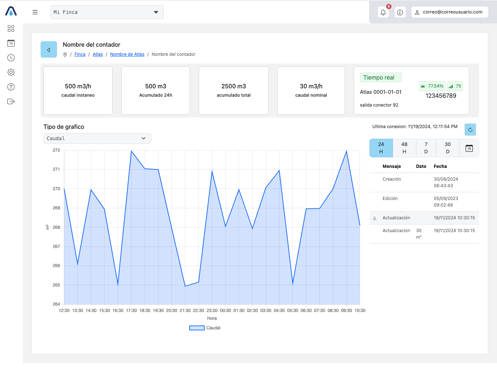

# Prueba Técnica Spherag

Para la prueba técnica, el proyecto ha sido desarrollado en **JavaScript Vanilla** utilizando **Web Components** para evitar el uso de librerías adicionales y mantener el proyecto lo más ligero posible.

### Entorno de Desarrollo

- **Vite** se ha utilizado como entorno de desarrollo para optimizar la configuración y el rendimiento.

### Librerías Adicionales

- **Flatpickr**: Utilizada para el selector de fechas ([Flatpickr Documentation](https://flatpickr.js.org/)).
- **Chart.js**: Implementada para generar gráficos de datos ([Chart.js Documentation](https://www.chartjs.org/)).

### Consideraciones

Para realizar la prueba correctamente, ha sido necesario deshabilitar **CORS** en el entorno de desarrollo.

### Ejecutar el Proyecto

Primero instalar todas las dependencias :

```bash
npm i
```
Entrar en modo desarrollo :

```bash
npm run dev
```

Para construir el proyecto en modo producción, utiliza el siguiente comando:

```bash
npm run build
```

